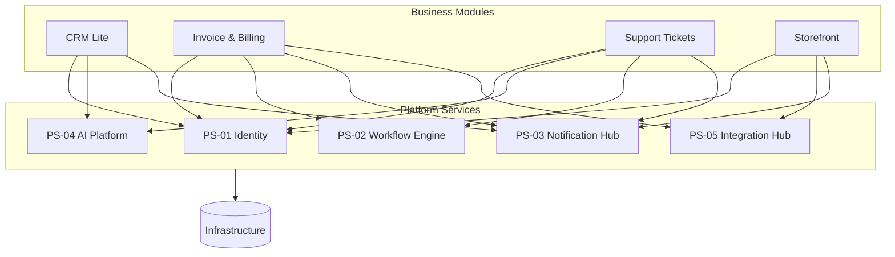

# 0815software

Standard business software — CRUD apps, dashboards, storefronts, internal
tools — built to be boring, MIT-licensed, and free. The codebase is
organized into **two independent catalogs**:

1. **[Business Modules](./modules/README.md)** — complete, customer-facing
   applications that solve an end-user problem on their own.
2. **[Platform Services](./platform/README.md)** — shared backend services
   that provide reusable capabilities consumed by modules over APIs.

## Architecture

```
Business Modules   →   customer-facing applications
        ↓
Platform Services  →   reusable backend capabilities
        ↓
Infrastructure     →   databases, queues, hosting
```

- **Modules are customer-facing applications.** Each solves a concrete
  business problem end to end and can be installed and run on its own.
- **Platform Services are reusable backend capabilities.** Each does one
  cross-cutting job — identity, automation, notifications, AI,
  integrations — and exposes it over an API.
- **Modules may depend on multiple Platform Services.** A module composes
  the services it needs rather than reimplementing them.
- **Platform Services never depend on Business Modules.** Dependencies
  point strictly downward: modules → services → infrastructure.

### Dependency direction

Modules depend on services; services depend on infrastructure and possibly
on each other; nothing points back up.



## Repository layout

```
/
├── modules/     Business Modules — customer-facing applications
├── platform/    Platform Services — shared backend capabilities (planned)
└── README.md
```

- [`modules/`](./modules/README.md) — the fourteen available Business
  Modules, each a self-contained application with its own `package.json`,
  `LICENSE` and README.
- [`platform/`](./platform/README.md) — the five Platform Services (PS-01
  Identity, PS-02 Workflow Engine, PS-03 Notification Hub, PS-04 AI
  Platform, PS-05 Integration Hub). Implemented as backend-only APIs
  (Express 5 + SQLite + tests, no client), each self-contained on its own
  port. Standalone in v1 — the identity seam to PS-01 is documented, not
  wired live.

## License

MIT — see [LICENSE](./LICENSE).
