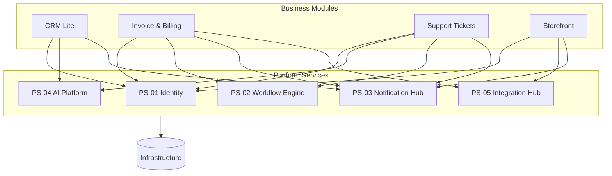

# 0815software

Standard business software — CRUD apps, dashboards, storefronts, internal
tools — built to be boring, MIT-licensed, and free. The codebase is
organized into **two independent catalogs**:

1. **[Business Modules](./modules/README.md)** — complete, customer-facing
   applications that solve an end-user problem on their own.
2. **[Platform Services](./platform/README.md)** — shared backend services
   that provide reusable capabilities consumed by modules over APIs.

## Architecture

```
Business Modules   →   customer-facing applications
        ↓
Platform Services  →   reusable backend capabilities
        ↓
Infrastructure     →   databases, queues, hosting
```

- **Modules are customer-facing applications.** Each solves a concrete
  business problem end to end and can be installed and run on its own.
- **Platform Services are reusable backend capabilities.** Each does one
  cross-cutting job — identity, automation, notifications, AI,
  integrations — and exposes it over an API.
- **Modules may depend on multiple Platform Services.** A module composes
  the services it needs rather than reimplementing them.
- **Platform Services never depend on Business Modules.** Dependencies
  point strictly downward: modules → services → infrastructure.

### Dependency direction

Modules depend on services; services depend on infrastructure and possibly
on each other; nothing points back up.



## Repository layout

```
/
├── modules/     Business Modules — customer-facing applications
│   └── registry.json   the machine-readable catalogue both sides derive from
├── platform/    Platform Services — shared backend capabilities
├── deploy/      Provisioning: a module selection → a customer deployment
├── demo/        The clickable demo and its headless end-to-end run
└── README.md
```

- [`modules/`](./modules/README.md) — the sixteen available Business
  Modules, each a self-contained application with its own `package.json`,
  `LICENSE` and README, plus
  [`registry.json`](./modules/registry.json): the machine-readable description
  of every module and service that the marketing catalogue, the demos and the
  provisioning script all derive from.
- [`platform/`](./platform/README.md) — the twelve Platform Services (PS-01
  Identity, PS-02 Workflow Engine, PS-03 Notification Hub, PS-04 AI Platform,
  PS-05 Integration Hub, PS-06 File Storage, PS-07 Audit Log, PS-08 Payments,
  PS-09 Search, PS-10 Number, PS-11 Customers, PS-12 e-Invoicing) and the shared
  [`clients`](./platform/clients) package. Implemented as backend-only APIs
  (Express 5 + SQLite + tests), each self-contained on its own port. All
  sixteen modules are wired in, opt-in and best-effort: a module with no
  service URLs configured still runs standalone.
- [`deploy/`](./deploy/README.md) — `provision.mjs` turns a customer's module
  selection into a ready-to-run stack (compose file, generated secrets, Caddy
  TLS, manifest), and `smoke-stack.mjs` boots that exact stack locally to prove
  it works. See [`docs/PROVISIONING.md`](./docs/PROVISIONING.md).

## Working in this repository

Every package installs and tests on its own (`npm ci && npm test` inside it).
There is one ordering rule, and it will bite you if you skip it:

> **Build `platform/clients` before installing any module.**
>
> ```sh
> cd platform/clients && npm ci && npm run build
> cd ../../modules/mod-04-invoice-billing && npm ci && npm test
> ```

Every module depends on `@0815software/platform-clients` through a `file:`
link, and npm **copies** a `file:` dependency rather than symlinking it. A module
installed before the clients package has been built therefore gets a copy with no
`dist/`, and its suite fails with:

```
Failed to resolve entry for package "@0815software/platform-clients".
```

The fix is to build the clients package and reinstall the module (`rm -rf
node_modules/@0815software && npm ci`). `deploy/module.Dockerfile` encodes the
same order, and [`.github/workflows/test.yml`](./.github/workflows/test.yml)
does too.

`deploy/` needs no root install — it is self-contained on purpose, so the
registry drift guard runs in a bare checkout:

```sh
cd deploy && npm ci && npm test
```

## License

MIT — see [LICENSE](./LICENSE).
